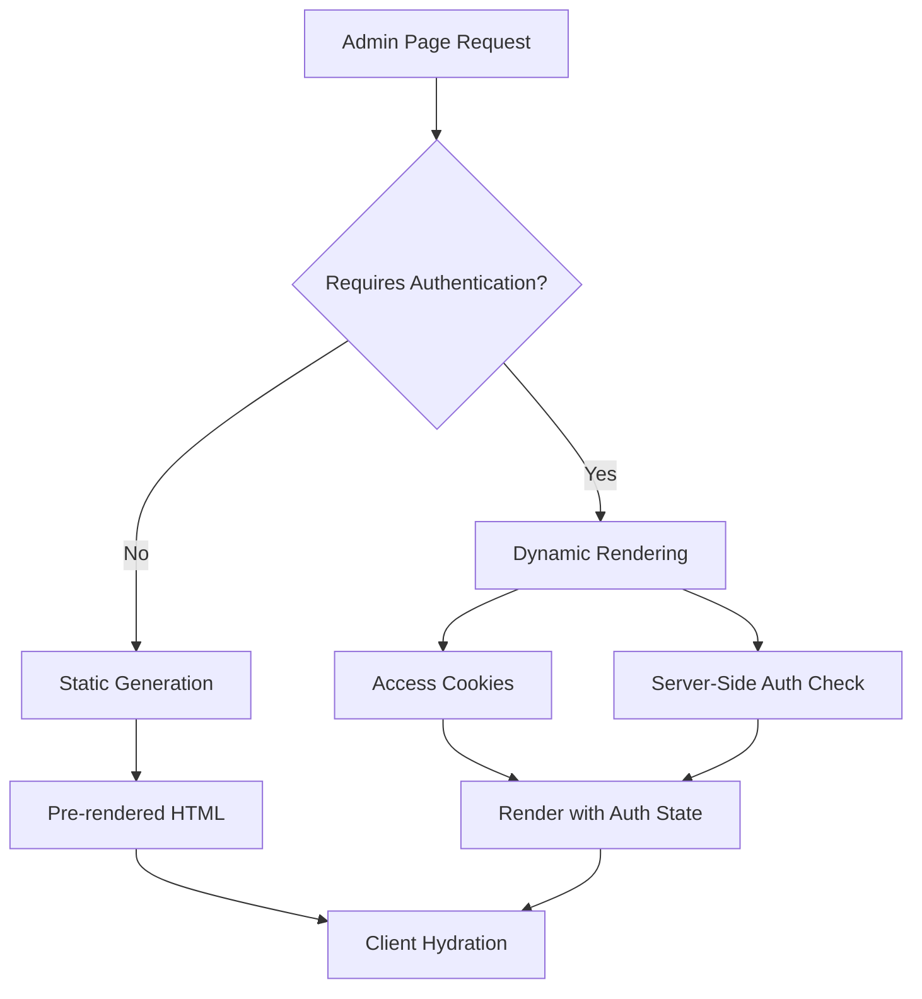

# Admin Dynamic Rendering Fix - Design Document

## Overview

This design addresses the dynamic server usage errors occurring during the build process for admin pages that use cookies for authentication. The solution involves properly configuring Next.js rendering strategies to handle server-side features while maintaining optimal performance.

## Architecture

### Current Issue Analysis

The build errors occur because:
1. Admin pages use `cookies()` for authentication during server-side rendering
2. Next.js tries to statically generate these pages during build
3. Static generation cannot access dynamic server features like cookies
4. This causes the "Dynamic server usage" error

### Solution Architecture



## Components and Interfaces

### 1. Dynamic Route Configuration

**Purpose:** Configure admin routes that require server-side features for dynamic rendering

**Implementation:**
- Add `export const dynamic = 'force-dynamic'` to pages using cookies
- Use `export const revalidate = 0` to prevent caching when needed
- Apply to specific admin pages: `/admin/settings`, `/admin/models`

### 2. Static Route Optimization

**Purpose:** Keep non-authentication pages static for performance

**Implementation:**
- Maintain static generation for pages that don't use server-side features
- Pages like `/admin/login`, `/admin/analytics` can remain static
- Use client-side authentication checks where appropriate

### 3. Authentication Strategy Refinement

**Purpose:** Optimize authentication handling for different rendering strategies

**Implementation:**
- Server-side authentication for dynamic pages
- Client-side authentication for static pages
- Hybrid approach for optimal performance

## Data Models

### Route Configuration Model

```typescript
interface RouteConfig {
  path: string;
  renderingStrategy: 'static' | 'dynamic';
  requiresAuth: boolean;
  usesServerFeatures: boolean;
}
```

### Admin Page Categories

1. **Dynamic Pages** (require server-side features):
   - `/admin/settings` - Uses cookies for theme/preferences
   - `/admin/models` - May use server-side model configuration

2. **Static Pages** (can be pre-rendered):
   - `/admin/login` - No server-side requirements
   - `/admin/analytics` - Data fetched client-side
   - `/admin/users` - Data fetched client-side
   - `/admin/security` - Data fetched client-side

## Error Handling

### Build-Time Error Prevention

1. **Route Analysis:** Identify pages using server-side features
2. **Configuration Validation:** Ensure proper dynamic/static configuration
3. **Build Process:** Handle dynamic routes appropriately during build

### Runtime Error Handling

1. **Authentication Fallbacks:** Handle cases where auth state is unavailable
2. **Loading States:** Provide appropriate loading indicators
3. **Error Boundaries:** Catch and handle authentication errors gracefully

## Testing Strategy

### Build Testing

1. **Static Generation Test:** Verify static pages build correctly
2. **Dynamic Rendering Test:** Verify dynamic pages handle server features
3. **Build Completion Test:** Ensure build completes without errors

### Functionality Testing

1. **Authentication Flow Test:** Verify admin authentication works correctly
2. **Route Access Test:** Test access to both static and dynamic admin routes
3. **Performance Test:** Measure impact of rendering strategy changes

### Integration Testing

1. **End-to-End Admin Flow:** Test complete admin user journey
2. **Cross-Route Navigation:** Test navigation between static and dynamic pages
3. **Session Management:** Test cookie-based session handling

## Implementation Approach

### Phase 1: Route Configuration
- Identify pages causing dynamic server usage errors
- Add appropriate export configurations to problematic pages
- Test build process with changes

### Phase 2: Authentication Optimization
- Review authentication strategy for each page type
- Optimize client-side vs server-side authentication usage
- Ensure consistent user experience

### Phase 3: Performance Validation
- Measure build time improvements
- Validate runtime performance
- Ensure no regression in functionality

## Security Considerations

1. **Authentication Consistency:** Ensure security is maintained across rendering strategies
2. **Session Security:** Maintain secure cookie handling in dynamic pages
3. **Access Control:** Verify proper access control regardless of rendering method

## Performance Implications

### Build Performance
- Reduced build errors and failures
- Faster build completion
- Proper static/dynamic page separation

### Runtime Performance
- Static pages load faster (pre-rendered)
- Dynamic pages handle server features properly
- Optimal caching strategies per page type