# Design Document

## Overview

This design transforms Pine Genie AI into a modern, Claude-style interface that enhances user experience through intuitive navigation, clean chat interactions, and seamless integration with Kiro's Spec functionality. The design maintains all existing functionality while introducing a professional, responsive layout that follows the "plan first, then build" methodology.

## Architecture

### High-Level System Architecture

```mermaid
graph TB
    A[Main Layout] --> B[Left Sidebar]
    A --> C[Main Chat Area]
    A --> D[Right Code Panel]
    A --> E[Bottom Input Area]
    
    B --> B1[Navigation Icons]
    B --> B2[Chat History]
    B --> B3[Spec Planning Panel]
    B --> B4[Settings/Profile]
    
    C --> C1[Message Bubbles]
    C --> C2[AI Responses]
    C --> C3[Typing Indicators]
    C --> C4[Timestamps]
    
    D --> D1[Code Display]
    D --> D2[Syntax Highlighting]
    D --> D3[Code Actions]
    D --> D4[Multiple Tabs]
    
    E --> E1[Multi-line Input]
    E --> E2[File Upload]
    E --> E3[Voice Input]
    E --> E4[Send Controls]
    
    F[State Management] --> G[Chat State]
    F --> H[UI State]
    F --> I[Code State]
    F --> J[Spec State]
```



### Component Hierarchy

```
PineGenieInterface (Main Container)
├── ClaudeSidebar
│   ├── NavigationIcons
│   ├── ChatHistoryList
│   ├── SpecPlanningPanel
│   └── UserProfileSection
├── MainChatArea
│   ├── MessageContainer
│   │   ├── UserMessage
│   │   └── AIMessage
│   ├── TypingIndicator
│   └── WelcomeScreen
├── RightCodePanel
│   ├── CodeTabs
│   ├── SyntaxHighlighter
│   ├── CodeActions
│   └── CodeExportOptions
└── ChatInputArea
    ├── MultiLineTextArea
    ├── FileUploadButton
    ├── VoiceInputButton
    └── SendButton
```

## Components and Interfaces

### 1. Main Layout Component

**File**: `src/app/ai-chat/components/ClaudeStyleInterface.tsx`

```typescript
interface ClaudeStyleInterfaceProps {
  initialConversation?: Conversation;
  userId: string;
}

interface LayoutState {
  sidebarCollapsed: boolean;
  codePanelOpen: boolean;
  currentConversation: string | null;
  activeSpecSession: string | null;
}
```

**Key Features**:
- Responsive grid layout with CSS Grid
- Dynamic panel resizing
- Theme integration with existing system
- Mobile-first responsive design

### 2. Left Sidebar Component

**File**: `src/app/ai-chat/components/ClaudeSidebar.tsx`

```typescript
interface SidebarProps {
  collapsed: boolean;
  onToggleCollapse: () => void;
  conversations: Conversation[];
  currentConversation: string | null;
  onSelectConversation: (id: string) => void;
  onNewChat: () => void;
}

interface Conversation {
  id: string;
  title: string;
  lastMessage: string;
  timestamp: Date;
  category: 'trend-following' | 'mean-reversion' | 'breakout' | 'custom';
  hasSpec: boolean;
}
```

**Key Features**:
- Collapsible with smooth animations
- Search functionality for conversations
- Folder organization by strategy type
- Spec planning integration
- Settings and profile access

### 3. Main Chat Area Component

**File**: `src/app/ai-chat/components/MainChatArea.tsx`

```typescript
interface ChatAreaProps {
  conversation: Conversation | null;
  messages: Message[];
  isLoading: boolean;
  onSendMessage: (content: string, files?: File[]) => void;
}

interface Message {
  id: string;
  role: 'user' | 'assistant';
  content: string;
  timestamp: Date;
  codeBlocks?: CodeBlock[];
  attachments?: Attachment[];
}

interface CodeBlock {
  id: string;
  language: 'pinescript' | 'javascript' | 'json';
  code: string;
  title?: string;
}
```

**Key Features**:
- Claude-style message bubbles
- Proper message alignment (user right, AI left)
- Smooth scrolling with scroll position memory
- Inline code syntax highlighting
- Message timestamps and status indicators

### 4. Right Code Panel Component

**File**: `src/app/ai-chat/components/RightCodePanel.tsx`

```typescript
interface CodePanelProps {
  isOpen: boolean;
  onToggle: () => void;
  codeBlocks: CodeBlock[];
  activeTab: string;
  onTabChange: (tabId: string) => void;
}

interface CodePanelState {
  tabs: CodeTab[];
  activeTabId: string;
  showLineNumbers: boolean;
  wordWrap: boolean;
  fontSize: number;
}

interface CodeTab {
  id: string;
  title: string;
  language: string;
  code: string;
  isDirty: boolean;
}
```

**Key Features**:
- Auto-opens when code is generated
- Multiple tab support
- Syntax highlighting for PineScript v6
- Code folding capabilities
- Copy, save, and export functionality
- Real-time syntax validation

### 5. Chat Input Component

**File**: `src/app/ai-chat/components/ChatInputArea.tsx`

```typescript
interface ChatInputProps {
  onSendMessage: (content: string, files?: File[]) => void;
  disabled: boolean;
  placeholder?: string;
}

interface InputState {
  content: string;
  files: File[];
  isRecording: boolean;
  height: number;
}
```

**Key Features**:
- Auto-resizing textarea (max 200px height)
- File upload with drag-and-drop
- Voice input integration
- Keyboard shortcuts (Enter to send, Shift+Enter for new line)
- Character count and typing indicators

### 6. Spec Planning Integration

**File**: `src/app/ai-chat/components/SpecPlanningPanel.tsx`

```typescript
interface SpecPlanningProps {
  isOpen: boolean;
  onToggle: () => void;
  currentSpec: SpecSession | null;
  onCreateSpec: () => void;
  onLoadSpec: (id: string) => void;
}

interface SpecSession {
  id: string;
  name: string;
  phase: 'requirements' | 'design' | 'tasks' | 'implementation';
  requirements: Requirement[];
  design: DesignDocument | null;
  tasks: Task[];
  createdAt: Date;
  updatedAt: Date;
}
```

**Key Features**:
- Integrated spec workflow
- Requirements gathering interface
- Strategy breakdown templates
- Step-by-step planning workflow
- Save/load planning sessions

## Data Models

### Chat System Models

```typescript
// Core chat models
interface User {
  id: string;
  email: string;
  name: string;
  preferences: UserPreferences;
}

interface UserPreferences {
  theme: 'dark' | 'light';
  sidebarCollapsed: boolean;
  codePanelWidth: number;
  fontSize: number;
  autoOpenCodePanel: boolean;
}

interface Conversation {
  id: string;
  userId: string;
  title: string;
  category: StrategyCategory;
  messages: Message[];
  specSessionId?: string;
  createdAt: Date;
  updatedAt: Date;
}

interface Message {
  id: string;
  conversationId: string;
  role: 'user' | 'assistant';
  content: string;
  codeBlocks: CodeBlock[];
  attachments: Attachment[];
  timestamp: Date;
}
```

### Spec Integration Models

```typescript
interface SpecSession {
  id: string;
  userId: string;
  name: string;
  description: string;
  phase: SpecPhase;
  requirements: Requirement[];
  design: DesignDocument | null;
  tasks: Task[];
  conversationId?: string;
  createdAt: Date;
  updatedAt: Date;
}

interface Requirement {
  id: string;
  userStory: string;
  acceptanceCriteria: string[];
  priority: 'high' | 'medium' | 'low';
  status: 'draft' | 'approved' | 'implemented';
}

interface Task {
  id: string;
  title: string;
  description: string;
  requirements: string[];
  status: 'not_started' | 'in_progress' | 'completed';
  estimatedHours: number;
  actualHours?: number;
}
```

### Code Management Models

```typescript
interface CodeBlock {
  id: string;
  messageId: string;
  language: 'pinescript' | 'javascript' | 'json';
  code: string;
  title?: string;
  description?: string;
  version: number;
  isValid: boolean;
  validationErrors: ValidationError[];
}

interface ValidationError {
  line: number;
  column: number;
  message: string;
  severity: 'error' | 'warning' | 'info';
}

interface CodeExport {
  format: 'png' | 'pdf' | 'txt' | 'json';
  options: ExportOptions;
}
```

## Error Handling

### Error Types and Handling Strategy

```typescript
interface ErrorBoundary {
  componentDidCatch(error: Error, errorInfo: ErrorInfo): void;
  render(): ReactNode;
}

interface APIError {
  code: string;
  message: string;
  details?: any;
  timestamp: Date;
}

interface ValidationError {
  field: string;
  message: string;
  value: any;
}
```

**Error Handling Patterns**:

1. **Network Errors**: Retry mechanism with exponential backoff
2. **Validation Errors**: Real-time feedback with helpful messages
3. **Code Generation Errors**: Fallback to template system
4. **File Upload Errors**: Clear error messages with retry options
5. **Authentication Errors**: Automatic redirect to login

### User-Friendly Error Messages

```typescript
const errorMessages = {
  NETWORK_ERROR: "Connection lost. Retrying automatically...",
  INVALID_CODE: "The generated code has syntax errors. Let me fix that for you.",
  FILE_TOO_LARGE: "File size exceeds 10MB limit. Please choose a smaller file.",
  UNSUPPORTED_FORMAT: "This file format isn't supported. Try .pine, .txt, or .json files.",
  RATE_LIMIT: "You're sending messages too quickly. Please wait a moment.",
  SESSION_EXPIRED: "Your session has expired. Redirecting to login..."
};
```

## Testing Strategy

### Component Testing

```typescript
// Example test structure
describe('ClaudeStyleInterface', () => {
  it('should render all main components', () => {
    render(<ClaudeStyleInterface userId="test-user" />);
    expect(screen.getByTestId('claude-sidebar')).toBeInTheDocument();
    expect(screen.getByTestId('main-chat-area')).toBeInTheDocument();
    expect(screen.getByTestId('chat-input-area')).toBeInTheDocument();
  });

  it('should handle sidebar collapse/expand', () => {
    const { getByTestId } = render(<ClaudeStyleInterface userId="test-user" />);
    const toggleButton = getByTestId('sidebar-toggle');
    
    fireEvent.click(toggleButton);
    expect(getByTestId('claude-sidebar')).toHaveClass('collapsed');
  });
});
```

### Integration Testing

1. **Chat Flow Testing**: Complete message send/receive cycle
2. **Code Generation Testing**: AI response with code block handling
3. **File Upload Testing**: Various file types and sizes
4. **Responsive Testing**: Different screen sizes and orientations
5. **Spec Integration Testing**: Planning workflow integration

### Performance Testing

```typescript
interface PerformanceMetrics {
  initialLoadTime: number;
  messageRenderTime: number;
  codeHighlightTime: number;
  scrollPerformance: number;
  memoryUsage: number;
}

const performanceTargets = {
  initialLoadTime: 2000, // 2 seconds
  messageRenderTime: 100, // 100ms
  codeHighlightTime: 200, // 200ms
  scrollPerformance: 60, // 60fps
  memoryUsage: 50 // 50MB max
};
```

## Responsive Design Strategy

### Breakpoint System

```css
/* Mobile First Approach */
:root {
  --sidebar-width: 280px;
  --code-panel-width: 400px;
  --mobile-breakpoint: 768px;
  --tablet-breakpoint: 1024px;
  --desktop-breakpoint: 1200px;
}

/* Mobile (< 768px) */
@media (max-width: 767px) {
  .claude-interface {
    grid-template-columns: 1fr;
    grid-template-areas: 
      "chat"
      "input";
  }
  
  .sidebar {
    position: fixed;
    transform: translateX(-100%);
    transition: transform 0.3s ease;
  }
  
  .sidebar.open {
    transform: translateX(0);
  }
}

/* Tablet (768px - 1023px) */
@media (min-width: 768px) and (max-width: 1023px) {
  .claude-interface {
    grid-template-columns: 60px 1fr;
    grid-template-areas: 
      "sidebar chat"
      "sidebar input";
  }
  
  .sidebar {
    width: 60px;
  }
  
  .code-panel {
    position: fixed;
    right: -400px;
    transition: right 0.3s ease;
  }
  
  .code-panel.open {
    right: 0;
  }
}

/* Desktop (>= 1024px) */
@media (min-width: 1024px) {
  .claude-interface {
    grid-template-columns: var(--sidebar-width) 1fr var(--code-panel-width);
    grid-template-areas: 
      "sidebar chat code"
      "sidebar input code";
  }
}
```

### Mobile Interaction Patterns

1. **Swipe Gestures**: Swipe right to open sidebar, swipe left to close
2. **Touch Targets**: Minimum 44px touch targets for all interactive elements
3. **Scroll Behavior**: Smooth scrolling with momentum
4. **Keyboard Handling**: Virtual keyboard awareness and adjustment

## Theme Integration

### CSS Custom Properties

```css
:root {
  /* Claude-style color palette */
  --claude-bg-primary: #1a1a1a;
  --claude-bg-secondary: #2d2d2d;
  --claude-bg-tertiary: #3a3a3a;
  --claude-text-primary: #ffffff;
  --claude-text-secondary: #b3b3b3;
  --claude-text-tertiary: #808080;
  --claude-border: #404040;
  --claude-accent: #ff6b35;
  --claude-success: #00d4aa;
  --claude-warning: #ffb800;
  --claude-error: #ff4757;
}

[data-theme="light"] {
  --claude-bg-primary: #ffffff;
  --claude-bg-secondary: #f8f9fa;
  --claude-bg-tertiary: #e9ecef;
  --claude-text-primary: #212529;
  --claude-text-secondary: #6c757d;
  --claude-text-tertiary: #adb5bd;
  --claude-border: #dee2e6;
  --claude-accent: #0066cc;
  --claude-success: #28a745;
  --claude-warning: #ffc107;
  --claude-error: #dc3545;
}
```

### Theme Context Integration

```typescript
interface ThemeContextExtension {
  claudeMode: boolean;
  toggleClaudeMode: () => void;
  sidebarTheme: 'dark' | 'light' | 'auto';
  codeTheme: 'vs-dark' | 'vs-light' | 'github-dark' | 'github-light';
}
```

## Performance Optimization

### Code Splitting Strategy

```typescript
// Lazy load heavy components
const CodeEditor = lazy(() => import('./components/CodeEditor'));
const SpecPlanningPanel = lazy(() => import('./components/SpecPlanningPanel'));
const VoiceInput = lazy(() => import('./components/VoiceInput'));

// Route-based splitting
const ClaudeInterface = lazy(() => import('./components/ClaudeStyleInterface'));
```

### Memory Management

1. **Message Virtualization**: Only render visible messages
2. **Code Block Caching**: Cache syntax-highlighted code
3. **Image Optimization**: Lazy load and compress images
4. **Event Listener Cleanup**: Proper cleanup on component unmount

### Bundle Optimization

```javascript
// webpack.config.js optimizations
module.exports = {
  optimization: {
    splitChunks: {
      chunks: 'all',
      cacheGroups: {
        vendor: {
          test: /[\\/]node_modules[\\/]/,
          name: 'vendors',
          chunks: 'all',
        },
        claude: {
          test: /[\\/]src[\\/]app[\\/]ai-chat[\\/]/,
          name: 'claude-interface',
          chunks: 'all',
        }
      }
    }
  }
};
```

## Security Considerations

### Input Sanitization

```typescript
interface SecurityConfig {
  maxMessageLength: 10000;
  maxFileSize: 10 * 1024 * 1024; // 10MB
  allowedFileTypes: string[];
  rateLimitPerMinute: 30;
  maxConcurrentRequests: 5;
}

const sanitizeInput = (input: string): string => {
  return DOMPurify.sanitize(input, {
    ALLOWED_TAGS: ['code', 'pre', 'strong', 'em'],
    ALLOWED_ATTR: ['class']
  });
};
```

### File Upload Security

1. **File Type Validation**: Whitelist approach for allowed file types
2. **Size Limits**: Enforce maximum file size limits
3. **Content Scanning**: Scan uploaded files for malicious content
4. **Temporary Storage**: Use temporary storage with automatic cleanup

## Accessibility Features

### WCAG 2.1 Compliance

```typescript
interface AccessibilityFeatures {
  keyboardNavigation: boolean;
  screenReaderSupport: boolean;
  highContrastMode: boolean;
  focusManagement: boolean;
  ariaLabels: boolean;
}
```

### Implementation Details

1. **Keyboard Navigation**: Full keyboard accessibility for all features
2. **Screen Reader Support**: Proper ARIA labels and live regions
3. **Focus Management**: Logical focus order and visible focus indicators
4. **Color Contrast**: WCAG AA compliant color ratios
5. **Text Scaling**: Support for 200% text scaling without horizontal scrolling

## Migration Strategy

### Backward Compatibility

1. **Existing Data**: Preserve all existing conversations and user data
2. **API Compatibility**: Maintain existing API endpoints
3. **Feature Parity**: Ensure all current features remain functional
4. **Gradual Rollout**: Feature flags for gradual deployment

### Database Migration

```sql
-- Add new tables for Claude interface features
CREATE TABLE conversation_categories (
  id UUID PRIMARY KEY DEFAULT gen_random_uuid(),
  name VARCHAR(50) NOT NULL,
  color VARCHAR(7) NOT NULL,
  icon VARCHAR(50) NOT NULL
);

CREATE TABLE spec_sessions (
  id UUID PRIMARY KEY DEFAULT gen_random_uuid(),
  user_id UUID NOT NULL REFERENCES users(id),
  conversation_id UUID REFERENCES conversations(id),
  name VARCHAR(255) NOT NULL,
  phase VARCHAR(20) NOT NULL DEFAULT 'requirements',
  data JSONB NOT NULL DEFAULT '{}',
  created_at TIMESTAMP DEFAULT NOW(),
  updated_at TIMESTAMP DEFAULT NOW()
);

-- Add indexes for performance
CREATE INDEX idx_conversations_user_category ON conversations(user_id, category);
CREATE INDEX idx_spec_sessions_user ON spec_sessions(user_id);
CREATE INDEX idx_messages_conversation_timestamp ON messages(conversation_id, timestamp);
```

This comprehensive design provides a solid foundation for implementing the Claude-style UI enhancement while maintaining all existing functionality and ensuring excellent user experience across all devices and use cases.