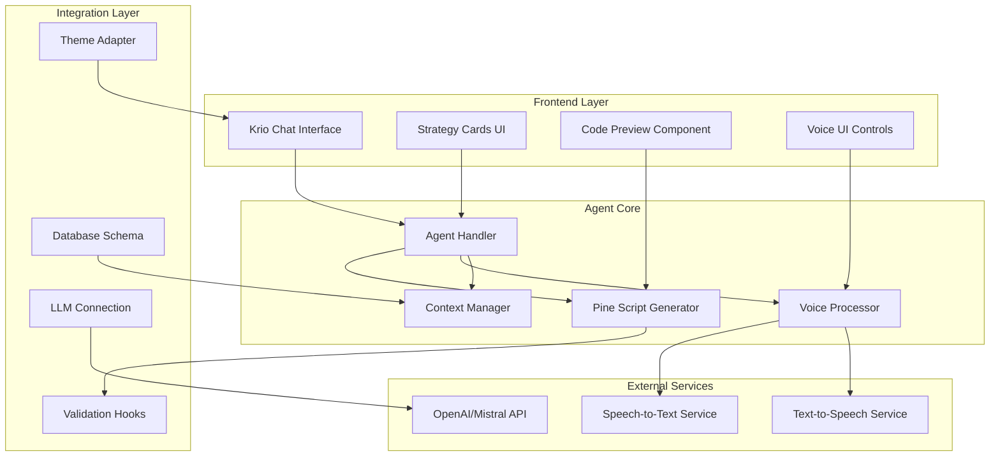

# Kiro-Style Pine Script Agent Design Document

## Overview

The Kiro-Style Pine Script Agent is a conversational AI system that integrates seamlessly with the existing PineGenie dashboard to provide natural language Pine Script generation, voice interaction capabilities, and automated code validation. The system follows Kiro's design principles of being supportive, knowledgeable, and user-focused while maintaining the existing visual consistency.

## Architecture

### High-Level Architecture



### Technology Stack

- **Frontend**: React 18, TypeScript, Tailwind CSS (existing dashboard theme)
- **Agent Core**: Custom agent handler with conversation management
- **LLM Integration**: OpenAI GPT-4 / Mistral AI with fallback mechanisms
- **Voice Processing**: Web Speech API + cloud speech services
- **Database**: PostgreSQL with Prisma ORM (extending existing schema)
- **Validation**: Custom Pine Script v6 syntax validator

## Components and Interfaces

### 1. Theme Integration System

#### Theme Adapter Interface
```typescript
interface ThemeAdapter {
  extractDashboardColors(): DashboardColorPalette;
  mapToAgentTheme(colors: DashboardColorPalette): AgentTheme;
  validateColorConsistency(): ValidationResult;
  updateThemeVariables(theme: AgentTheme): void;
}

interface DashboardColorPalette {
  primary: string;
  secondary: string;
  accent: string;
  background: string;
  surface: string;
  text: {
    primary: string;
    secondary: string;
    muted: string;
  };
  status: {
    success: string;
    warning: string;
    error: string;
    info: string;
  };
}
```

#### UI Component Structure
```
/components/ai-chat (existing - enhanced)
├── enhanced-chat-interface.tsx
├── message-bubble.tsx
└── typing-indicator.tsx

/agents (new)
├── /pinegenie-agent
│   ├── /core
│   │   ├── agent-handler.js
│   │   ├── pine-generator.js
│   │   └── voice-processor.js
│   ├── /ui
│   │   ├── krio-chat-interface.jsx
│   │   ├── strategy-cards.jsx
│   │   └── code-preview.jsx
│   └── /config
│       ├── steering-rules.js
│       └── theme-adapter.js
```

### 2. Pine Script Generation Engine

#### Pine Script Generator Interface
```typescript
interface PineScriptGenerator {
  generateFromPrompt(prompt: string, context?: StrategyContext): Promise<GeneratedCode>;
  validateSyntax(code: string): Promise<ValidationResult>;
  optimizeCode(code: string): Promise<OptimizedCode>;
  addDocumentation(code: string): Promise<DocumentedCode>;
  applyTemplate(template: StrategyTemplate, params: TemplateParams): Promise<GeneratedCode>;
}

interface GeneratedCode {
  code: string;
  explanation: string;
  indicators: IndicatorInfo[];
  riskManagement: RiskControls;
  confidence: number;
  suggestions: string[];
}

interface StrategyTemplate {
  id: string;
  name: string;
  category: 'trend-following' | 'mean-reversion' | 'breakout' | 'scalping';
  codeTemplate: string;
  parameters: TemplateParameter[];
  description: string;
}
```

#### Template System
- **Trend Following**: Moving average crossovers, trend indicators
- **Mean Reversion**: RSI, Bollinger Bands, oversold/overbought conditions
- **Breakout**: Support/resistance levels, volume confirmation
- **Scalping**: Short-term indicators, quick entry/exit logic

### 3. Conversational Agent System

#### Agent Handler Interface
```typescript
interface AgentHandler {
  processMessage(message: string, context: ConversationContext): Promise<AgentResponse>;
  maintainContext(sessionId: string): ConversationContext;
  trackProgress(sessionId: string, step: ProgressStep): void;
  generateFollowUp(context: ConversationContext): string[];
}

interface ConversationContext {
  sessionId: string;
  userId: string;
  conversationHistory: Message[];
  currentStrategy?: PartialStrategy;
  preferences: UserPreferences;
  progressSteps: ProgressStep[];
}

interface AgentResponse {
  message: string;
  code?: GeneratedCode;
  suggestions: string[];
  nextSteps: string[];
  requiresInput: boolean;
  voiceResponse?: AudioBuffer;
}
```

#### Conversation Flow Management
- **Initialization**: Welcome message, context setup, preference detection
- **Strategy Discovery**: Question-based strategy exploration
- **Code Generation**: Iterative code creation and refinement
- **Validation**: Automated testing and user feedback
- **Finalization**: Export preparation and documentation

### 4. Voice Integration System

#### Voice Processor Interface
```typescript
interface VoiceProcessor {
  startListening(): Promise<void>;
  stopListening(): Promise<string>;
  processVoiceInput(audio: AudioBuffer): Promise<string>;
  generateVoiceResponse(text: string): Promise<AudioBuffer>;
  configureTradingVocabulary(): void;
}

interface TradingVocabulary {
  indicators: string[];
  timeframes: string[];
  orderTypes: string[];
  riskTerms: string[];
  commonPhrases: Map<string, string>;
}
```

#### Voice Features
- **Speech Recognition**: Optimized for trading terminology
- **Audio Feedback**: Confirmations, clarifications, status updates
- **Hands-free Operation**: Complete strategy creation via voice
- **Multi-modal**: Seamless switching between voice and text

### 5. Agent Hooks and Automation

#### Hook System Interface
```typescript
interface AgentHook {
  name: string;
  trigger: HookTrigger;
  execute(context: HookContext): Promise<HookResult>;
  priority: number;
}

interface ValidationHook extends AgentHook {
  validateSyntax(code: string): Promise<ValidationResult>;
  checkBestPractices(code: string): Promise<BestPracticeResult>;
  suggestImprovements(code: string): Promise<ImprovementSuggestion[]>;
}

interface RiskManagementHook extends AgentHook {
  injectStopLoss(code: string): Promise<string>;
  addPositionSizing(code: string): Promise<string>;
  validateRiskControls(code: string): Promise<RiskValidationResult>;
}
```

#### Automated Hooks
- **Code Validation**: Syntax checking, error detection
- **Risk Management**: Stop loss injection, position sizing
- **Documentation**: Comment generation, explanation creation
- **Performance**: Code optimization, efficiency improvements

## Data Models

### Database Schema Extensions

#### Agent Conversations Table
```sql
CREATE TABLE agent_conversations (
  id UUID PRIMARY KEY DEFAULT gen_random_uuid(),
  user_id UUID REFERENCES users(id) ON DELETE CASCADE,
  session_id VARCHAR(255) NOT NULL,
  agent_type VARCHAR(100) DEFAULT 'pinescript',
  context JSONB NOT NULL DEFAULT '{}',
  created_at TIMESTAMP DEFAULT NOW(),
  updated_at TIMESTAMP DEFAULT NOW()
);
```

#### Conversation Messages Table
```sql
CREATE TABLE conversation_messages (
  id UUID PRIMARY KEY DEFAULT gen_random_uuid(),
  conversation_id UUID REFERENCES agent_conversations(id) ON DELETE CASCADE,
  role VARCHAR(50) NOT NULL, -- 'user', 'agent', 'system'
  content TEXT NOT NULL,
  metadata JSONB DEFAULT '{}',
  created_at TIMESTAMP DEFAULT NOW()
);
```

#### Generated Code Table
```sql
CREATE TABLE generated_code (
  id UUID PRIMARY KEY DEFAULT gen_random_uuid(),
  conversation_id UUID REFERENCES agent_conversations(id) ON DELETE CASCADE,
  user_id UUID REFERENCES users(id) ON DELETE CASCADE,
  code TEXT NOT NULL,
  language VARCHAR(50) DEFAULT 'pinescript',
  version INTEGER DEFAULT 1,
  validation_status VARCHAR(50) DEFAULT 'pending',
  metadata JSONB DEFAULT '{}',
  created_at TIMESTAMP DEFAULT NOW()
);
```

### Caching Strategy

#### Redis Cache Structure
- Agent sessions: `agent:session:{sessionId}`
- Generated code: `agent:code:{userId}:{codeId}`
- Voice responses: `agent:voice:{hash}`
- Template cache: `agent:templates:{category}`
- Validation results: `agent:validation:{codeHash}`

## Error Handling

### Error Classification
1. **LLM Errors**: API failures, rate limits, invalid responses
2. **Voice Processing Errors**: Speech recognition failures, audio issues
3. **Code Generation Errors**: Syntax errors, validation failures
4. **Context Errors**: Session timeouts, context corruption

### Error Recovery Strategies
- **LLM Fallbacks**: Multiple model providers, cached responses
- **Voice Fallbacks**: Text input alternatives, error audio prompts
- **Code Recovery**: Template fallbacks, incremental generation
- **Context Recovery**: Session restoration, progress tracking

## Testing Strategy

### Testing Approach

#### Unit Tests
- Pine Script generation accuracy
- Voice processing reliability
- Theme adapter functionality
- Hook execution validation

#### Integration Tests
- End-to-end conversation flows
- Voice-to-code generation pipeline
- Database persistence and retrieval
- LLM integration reliability

#### User Experience Tests
- Conversation naturalness
- Voice recognition accuracy
- UI responsiveness and consistency
- Error handling user experience

## Security Considerations

### Data Protection
- Conversation encryption at rest
- Voice data privacy compliance
- Generated code intellectual property protection
- User session security

### API Security
- LLM API key management
- Rate limiting and abuse prevention
- Input sanitization and validation
- Output filtering and safety checks

## Performance Optimization

### Response Time Optimization
- LLM response caching
- Parallel processing for validation hooks
- Optimized database queries
- Efficient voice processing

### Resource Management
- Memory-efficient conversation context
- Streaming responses for long code generation
- Background processing for non-critical tasks
- Intelligent caching strategies

## Deployment and Monitoring

### Deployment Strategy
- Gradual rollout with feature flags
- A/B testing for conversation flows
- Performance monitoring and alerting
- User feedback collection and analysis

### Monitoring Metrics
- Conversation completion rates
- Code generation accuracy
- Voice recognition success rates
- User satisfaction scores
- System performance metrics