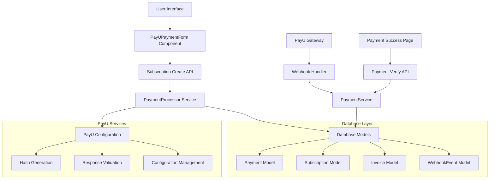

# PayU Payment Integration Audit - Design Document

## Overview

This design document outlines the technical approach for auditing and improving the existing PayU payment integration in the PineGenie application. The audit will systematically examine all components of the PayU integration, identify potential issues, and implement improvements to ensure robust, secure, and reliable payment processing.

## Architecture

### Current PayU Integration Architecture



### Audit Architecture

The audit will be structured into several key components:

1. **Configuration Auditor** - Validates PayU configuration and environment setup
2. **Security Auditor** - Checks hash generation, validation, and security practices
3. **Flow Auditor** - Tests complete payment flows end-to-end
4. **Data Auditor** - Validates database integration and data consistency
5. **Performance Auditor** - Monitors and tests performance characteristics
6. **Error Auditor** - Tests error handling and logging mechanisms

## Components and Interfaces

### 1. PayU Configuration Auditor

**Purpose:** Validate PayU configuration and environment variables

**Interface:**
```typescript
interface ConfigurationAuditor {
  validateEnvironmentVariables(): AuditResult;
  validatePayUCredentials(): AuditResult;
  checkEnvironmentConsistency(): AuditResult;
  validateURLConfiguration(): AuditResult;
}

interface AuditResult {
  passed: boolean;
  issues: Issue[];
  recommendations: string[];
  severity: 'low' | 'medium' | 'high' | 'critical';
}
```

**Key Checks:**
- Environment variable presence and format
- Merchant key and salt validation
- URL configuration for different environments
- SSL/TLS configuration verification

### 2. Security Auditor

**Purpose:** Validate security aspects of PayU integration

**Interface:**
```typescript
interface SecurityAuditor {
  validateHashGeneration(): AuditResult;
  validateResponseVerification(): AuditResult;
  checkDataEncryption(): AuditResult;
  validateWebhookSecurity(): AuditResult;
  checkPCICompliance(): AuditResult;
}
```

**Key Checks:**
- Hash generation algorithm correctness
- Response hash verification
- Sensitive data handling
- Webhook signature validation
- PCI DSS compliance aspects

### 3. Payment Flow Auditor

**Purpose:** Test complete payment flows and user journeys

**Interface:**
```typescript
interface PaymentFlowAuditor {
  testPaymentInitiation(): AuditResult;
  testPayURedirection(): AuditResult;
  testSuccessFlow(): AuditResult;
  testFailureFlow(): AuditResult;
  testWebhookProcessing(): AuditResult;
}
```

**Key Flows:**
- Payment creation and form generation
- PayU redirection and parameter validation
- Success callback handling
- Failure callback handling
- Webhook processing and validation

### 4. Database Integration Auditor

**Purpose:** Validate database operations and data consistency

**Interface:**
```typescript
interface DatabaseAuditor {
  validatePaymentModel(): AuditResult;
  checkDataConsistency(): AuditResult;
  testTransactionIntegrity(): AuditResult;
  validateRelationships(): AuditResult;
}
```

**Key Checks:**
- Payment record creation and updates
- Subscription activation consistency
- Invoice generation accuracy
- Webhook event logging

### 5. Error Handling Auditor

**Purpose:** Test error scenarios and logging mechanisms

**Interface:**
```typescript
interface ErrorHandlingAuditor {
  testPaymentErrors(): AuditResult;
  testWebhookErrors(): AuditResult;
  validateErrorLogging(): AuditResult;
  testRecoveryMechanisms(): AuditResult;
}
```

## Data Models

### Audit Report Model

```typescript
interface PayUAuditReport {
  id: string;
  timestamp: Date;
  version: string;
  environment: 'development' | 'staging' | 'production';
  overallStatus: 'passed' | 'failed' | 'warning';
  
  sections: {
    configuration: AuditSection;
    security: AuditSection;
    paymentFlow: AuditSection;
    database: AuditSection;
    errorHandling: AuditSection;
    performance: AuditSection;
  };
  
  summary: {
    totalChecks: number;
    passedChecks: number;
    failedChecks: number;
    criticalIssues: number;
    recommendations: string[];
  };
}

interface AuditSection {
  name: string;
  status: 'passed' | 'failed' | 'warning';
  checks: AuditCheck[];
  executionTime: number;
}

interface AuditCheck {
  name: string;
  description: string;
  status: 'passed' | 'failed' | 'skipped';
  result: AuditResult;
  executionTime: number;
}
```

### Issue Tracking Model

```typescript
interface Issue {
  id: string;
  type: 'configuration' | 'security' | 'functionality' | 'performance' | 'data';
  severity: 'low' | 'medium' | 'high' | 'critical';
  title: string;
  description: string;
  location: string; // File path or component
  recommendation: string;
  fixable: boolean;
  autoFixAvailable: boolean;
}
```

## Error Handling

### Error Classification

1. **Configuration Errors**
   - Missing environment variables
   - Invalid merchant credentials
   - Incorrect URL configurations

2. **Security Errors**
   - Hash generation failures
   - Invalid signatures
   - Insecure data handling

3. **Integration Errors**
   - PayU API communication failures
   - Database operation failures
   - Webhook processing errors

4. **Data Consistency Errors**
   - Payment-subscription mismatches
   - Invoice generation failures
   - Audit trail gaps

### Error Recovery Strategies

```typescript
interface ErrorRecoveryStrategy {
  retryMechanism: {
    maxAttempts: number;
    backoffStrategy: 'linear' | 'exponential';
    retryableErrors: string[];
  };
  
  fallbackMechanisms: {
    manualProcessing: boolean;
    adminNotification: boolean;
    userNotification: boolean;
  };
  
  dataRecovery: {
    transactionRollback: boolean;
    stateReconstruction: boolean;
    manualIntervention: boolean;
  };
}
```

## Testing Strategy

### 1. Unit Testing

**Scope:** Individual components and functions
- Hash generation functions
- Configuration validation
- Data model operations
- Error handling utilities

**Tools:** Jest, Testing Library

### 2. Integration Testing

**Scope:** Component interactions and API endpoints
- PayU form generation
- Webhook processing
- Database operations
- Service integrations

**Tools:** Jest, Supertest, Test Database

### 3. End-to-End Testing

**Scope:** Complete payment flows
- Payment initiation to completion
- Success and failure scenarios
- Webhook delivery and processing
- User experience validation

**Tools:** Playwright, PayU Test Environment

### 4. Security Testing

**Scope:** Security vulnerabilities and compliance
- Hash validation testing
- Injection attack prevention
- Data encryption verification
- PCI compliance checks

**Tools:** Custom security test suite

### 5. Performance Testing

**Scope:** System performance under load
- Payment processing throughput
- Webhook processing latency
- Database query performance
- Memory and CPU usage

**Tools:** Artillery, Custom performance monitors

## Implementation Phases

### Phase 1: Audit Framework Setup
- Create audit infrastructure
- Implement base auditor classes
- Set up reporting mechanisms
- Create test data and fixtures

### Phase 2: Configuration and Security Audit
- Implement configuration auditor
- Implement security auditor
- Create automated security tests
- Generate initial audit reports

### Phase 3: Flow and Integration Audit
- Implement payment flow auditor
- Implement database auditor
- Create end-to-end test scenarios
- Validate webhook processing

### Phase 4: Error Handling and Performance Audit
- Implement error handling auditor
- Implement performance auditor
- Create stress test scenarios
- Validate recovery mechanisms

### Phase 5: Reporting and Remediation
- Generate comprehensive audit reports
- Implement auto-fix mechanisms
- Create monitoring dashboards
- Document best practices

## Monitoring and Alerting

### Real-time Monitoring

```typescript
interface PayUMonitoring {
  paymentMetrics: {
    successRate: number;
    averageProcessingTime: number;
    errorRate: number;
    webhookDeliveryRate: number;
  };
  
  securityMetrics: {
    invalidSignatureAttempts: number;
    suspiciousActivity: number;
    failedValidations: number;
  };
  
  performanceMetrics: {
    responseTime: number;
    throughput: number;
    errorLatency: number;
  };
}
```

### Alert Conditions

1. **Critical Alerts**
   - Payment success rate < 95%
   - Security validation failures
   - Database connection failures
   - Webhook processing failures

2. **Warning Alerts**
   - Payment processing time > 30 seconds
   - Error rate > 5%
   - Configuration inconsistencies
   - Performance degradation

## Security Considerations

### Data Protection
- Encrypt sensitive payment data
- Implement proper access controls
- Ensure PCI DSS compliance
- Regular security audits

### Hash Security
- Use secure hash algorithms (SHA-512)
- Implement proper salt handling
- Validate all incoming hashes
- Log security events

### Webhook Security
- Validate webhook signatures
- Implement replay attack prevention
- Use HTTPS for all communications
- Rate limiting and throttling

## Performance Optimization

### Database Optimization
- Index critical payment queries
- Implement connection pooling
- Use read replicas for reporting
- Archive old payment data

### Caching Strategy
- Cache PayU configuration
- Cache validation results
- Implement Redis for session data
- Use CDN for static assets

### Monitoring and Profiling
- Application performance monitoring
- Database query profiling
- Memory usage tracking
- Error rate monitoring

## Compliance and Audit Trail

### Audit Logging
- Log all payment operations
- Track configuration changes
- Monitor security events
- Maintain webhook processing logs

### Compliance Requirements
- PCI DSS compliance
- Data protection regulations
- Financial audit requirements
- Security compliance standards

### Reporting
- Generate compliance reports
- Create audit trail documentation
- Implement automated reporting
- Maintain historical records