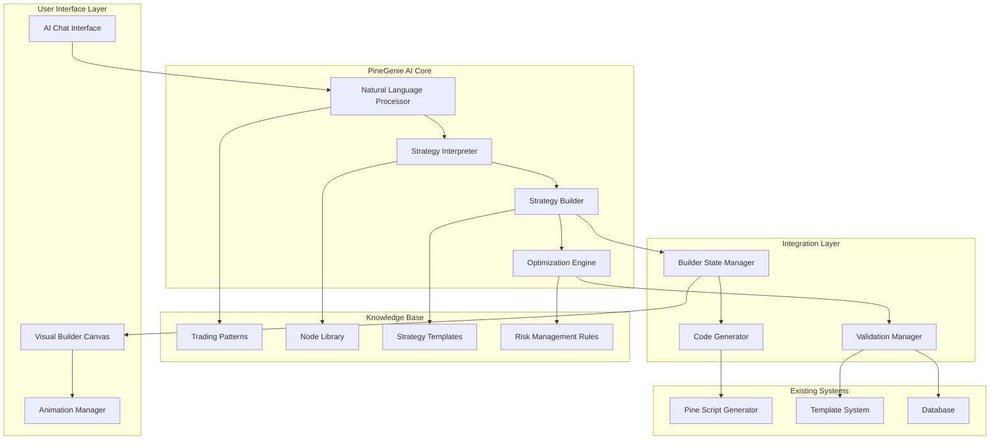

# Design Document

## Overview

PineGenie AI is a custom JavaScript-based intelligence system that transforms natural language trading requests into complete visual strategies through automated node placement and connection. The system integrates seamlessly with the existing PineScript visual builder, providing an intelligent layer that eliminates the learning curve for new users while maintaining full compatibility with manual building modes.

The AI operates entirely offline using custom JavaScript logic, pattern matching, and rule-based decision making to interpret user intent and construct professional-grade trading strategies with proper risk management, signal generation, and parameter optimization.

## Architecture

### High-Level System Architecture



### Core Components Architecture

```mermaid
graph LR
    subgraph "Natural Language Processor"
        TP[Text Parser]
        IE[Intent Extractor]
        PE[Parameter Extractor]
        CE[Context Engine]
    end
    
    subgraph "Strategy Interpreter"
        PM[Pattern Matcher]
        LM[Logic Mapper]
        DG[Dependency Graph]
        VE[Validation Engine]
    end
    
    subgraph "Strategy Builder"
        NP[Node Placer]
        CC[Connection Creator]
        PP[Parameter Processor]
        LO[Layout Optimizer]
    end
    
    TP --> IE
    IE --> PE
    PE --> CE
    
    CE --> PM
    PM --> LM
    LM --> DG
    DG --> VE
    
    VE --> NP
    NP --> CC
    CC --> PP
    PP --> LO
```



## Components and Interfaces

### 1. Natural Language Processor (NLP)

**Purpose**: Parse and understand natural language trading requests

**Interface**:
```typescript
interface NaturalLanguageProcessor {
  parseRequest(input: string): ParsedRequest;
  extractIntent(request: ParsedRequest): TradingIntent;
  extractParameters(request: ParsedRequest): StrategyParameters;
  validateInput(input: string): ValidationResult;
}

interface ParsedRequest {
  originalText: string;
  tokens: Token[];
  entities: Entity[];
  confidence: number;
}

interface TradingIntent {
  strategyType: 'trend-following' | 'mean-reversion' | 'breakout' | 'scalping' | 'custom';
  indicators: string[];
  conditions: string[];
  actions: string[];
  riskManagement: string[];
  timeframe?: string;
  confidence: number;
}
```

**Implementation Details**:
- Custom tokenizer for trading terminology
- Pattern matching for common trading phrases
- Entity recognition for indicators, timeframes, and parameters
- Context-aware parsing for ambiguous requests
- Confidence scoring for interpretation accuracy

### 2. Strategy Interpreter

**Purpose**: Convert parsed natural language into strategy blueprints

**Interface**:
```typescript
interface StrategyInterpreter {
  interpretIntent(intent: TradingIntent): StrategyBlueprint;
  mapToNodes(blueprint: StrategyBlueprint): NodeConfiguration[];
  createConnections(nodes: NodeConfiguration[]): ConnectionConfiguration[];
  optimizeStrategy(strategy: StrategyConfiguration): StrategyConfiguration;
}

interface StrategyBlueprint {
  id: string;
  name: string;
  description: string;
  components: StrategyComponent[];
  flow: StrategyFlow[];
  parameters: ParameterSet;
  riskProfile: RiskProfile;
}

interface StrategyComponent {
  type: 'data-source' | 'indicator' | 'condition' | 'action' | 'risk' | 'timing';
  subtype: string;
  parameters: Record<string, unknown>;
  priority: number;
  dependencies: string[];
}
```

**Implementation Details**:
- Rule-based mapping from intents to strategy components
- Dependency resolution for component ordering
- Parameter optimization based on market conditions
- Risk management integration
- Strategy validation and completeness checking

### 3. Strategy Builder

**Purpose**: Automatically place and connect nodes on the visual canvas

**Interface**:
```typescript
interface StrategyBuilder {
  buildStrategy(blueprint: StrategyBlueprint): BuildResult;
  placeNodes(nodes: NodeConfiguration[]): PlacementResult;
  createConnections(connections: ConnectionConfiguration[]): ConnectionResult;
  animateConstruction(strategy: StrategyConfiguration): AnimationSequence;
}

interface BuildResult {
  success: boolean;
  nodes: BuilderNode[];
  edges: BuilderEdge[];
  animations: AnimationStep[];
  explanations: ExplanationStep[];
  errors: string[];
  warnings: string[];
}

interface AnimationStep {
  type: 'node-placement' | 'connection-creation' | 'parameter-setting';
  nodeId?: string;
  duration: number;
  explanation: string;
  highlight: boolean;
}
```

**Implementation Details**:
- Intelligent node positioning using existing positioning utilities
- Automatic connection creation with validation
- Step-by-step animation system
- Educational explanations for each step
- Integration with existing builder state management

### 4. AI Chat Interface

**Purpose**: Provide conversational interface for AI interactions

**Interface**:
```typescript
interface AIChatInterface {
  sendMessage(message: string): Promise<AIResponse>;
  getConversationHistory(): ChatMessage[];
  clearConversation(): void;
  setMode(mode: 'assistant' | 'builder' | 'optimizer'): void;
}

interface AIResponse {
  message: string;
  actions?: AIAction[];
  suggestions?: string[];
  needsConfirmation?: boolean;
  strategyPreview?: StrategyPreview;
}

interface AIAction {
  type: 'build-strategy' | 'modify-strategy' | 'optimize-parameters' | 'explain-concept';
  payload: Record<string, unknown>;
  description: string;
}
```

**Implementation Details**:
- Real-time chat interface with typing indicators
- Action buttons for common requests
- Strategy preview cards
- Conversation context management
- Integration with existing UI theme system

### 5. Knowledge Base System

**Purpose**: Store and retrieve trading knowledge and patterns

**Interface**:
```typescript
interface KnowledgeBase {
  getPatterns(category: string): TradingPattern[];
  getNodeTemplates(type: string): NodeTemplate[];
  getStrategyTemplates(filters: TemplateFilters): StrategyTemplate[];
  getRiskRules(strategyType: string): RiskRule[];
}

interface TradingPattern {
  id: string;
  name: string;
  description: string;
  keywords: string[];
  indicators: string[];
  conditions: string[];
  riskLevel: 'low' | 'medium' | 'high';
  complexity: 'beginner' | 'intermediate' | 'advanced';
}
```

**Implementation Details**:
- JSON-based knowledge storage
- Fast pattern matching algorithms
- Hierarchical template organization
- Risk assessment rules
- Performance optimization for quick lookups

## Data Models

### Core Data Structures

```typescript
// AI-specific extensions to existing node system
interface AINodeData extends NodeData {
  aiGenerated: boolean;
  confidence: number;
  explanation: string;
  suggestedParameters: Record<string, unknown>;
  optimizationHints: string[];
}

interface AIStrategyMetadata {
  generatedBy: 'ai' | 'template' | 'manual';
  originalRequest: string;
  confidence: number;
  buildSteps: BuildStep[];
  optimizations: Optimization[];
  riskAssessment: RiskAssessment;
}

interface BuildStep {
  stepNumber: number;
  action: 'place-node' | 'create-connection' | 'set-parameter';
  description: string;
  reasoning: string;
  nodeId?: string;
  connectionId?: string;
  parameter?: ParameterChange;
}

interface Optimization {
  type: 'parameter' | 'structure' | 'risk';
  description: string;
  impact: 'low' | 'medium' | 'high';
  recommendation: string;
  autoApply: boolean;
}
```

### Knowledge Base Models

```typescript
interface TradingKnowledge {
  patterns: Map<string, TradingPattern>;
  indicators: Map<string, IndicatorDefinition>;
  strategies: Map<string, StrategyTemplate>;
  riskRules: Map<string, RiskRule>;
  optimizations: Map<string, OptimizationRule>;
}

interface IndicatorDefinition {
  id: string;
  name: string;
  category: string;
  parameters: ParameterDefinition[];
  outputs: OutputDefinition[];
  useCases: string[];
  combinations: string[];
  riskFactors: string[];
}

interface ParameterDefinition {
  name: string;
  type: 'int' | 'float' | 'bool' | 'string' | 'source';
  defaultValue: unknown;
  range?: [number, number];
  options?: string[];
  description: string;
  impact: 'low' | 'medium' | 'high';
}
```

## Error Handling

### Error Categories and Handling

```typescript
interface AIErrorHandler {
  handleParsingError(error: ParsingError): ErrorResponse;
  handleBuildError(error: BuildError): ErrorResponse;
  handleValidationError(error: ValidationError): ErrorResponse;
  handleOptimizationError(error: OptimizationError): ErrorResponse;
}

enum AIErrorType {
  PARSING_FAILED = 'parsing_failed',
  AMBIGUOUS_REQUEST = 'ambiguous_request',
  INSUFFICIENT_INFORMATION = 'insufficient_information',
  INVALID_STRATEGY = 'invalid_strategy',
  BUILD_FAILED = 'build_failed',
  OPTIMIZATION_FAILED = 'optimization_failed',
  VALIDATION_FAILED = 'validation_failed'
}

interface ErrorResponse {
  type: AIErrorType;
  message: string;
  suggestions: string[];
  clarificationQuestions?: string[];
  fallbackOptions?: FallbackOption[];
  canRetry: boolean;
}
```

### Error Recovery Strategies

1. **Parsing Errors**: Provide clarification questions and suggest similar patterns
2. **Build Errors**: Offer simplified alternatives and manual building options
3. **Validation Errors**: Explain issues and provide automatic fixes
4. **Optimization Errors**: Fall back to default parameters with explanations

## Testing Strategy

### Unit Testing

```typescript
// Natural Language Processing Tests
describe('NaturalLanguageProcessor', () => {
  test('should parse simple RSI strategy request', () => {
    const input = "Create a strategy that buys when RSI is below 30";
    const result = nlp.parseRequest(input);
    expect(result.intent.strategyType).toBe('mean-reversion');
    expect(result.intent.indicators).toContain('rsi');
  });
  
  test('should handle ambiguous requests', () => {
    const input = "Make me money with moving averages";
    const result = nlp.parseRequest(input);
    expect(result.confidence).toBeLessThan(0.8);
  });
});

// Strategy Builder Tests
describe('StrategyBuilder', () => {
  test('should build complete RSI strategy', () => {
    const blueprint = createRSIBlueprint();
    const result = builder.buildStrategy(blueprint);
    expect(result.success).toBe(true);
    expect(result.nodes).toHaveLength(4); // Data, RSI, Condition, Action
    expect(result.edges).toHaveLength(3);
  });
  
  test('should create proper node connections', () => {
    const nodes = createTestNodes();
    const result = builder.createConnections(nodes);
    expect(result.connections).toBeValidConnections();
  });
});
```

### Integration Testing

```typescript
// End-to-End AI Workflow Tests
describe('PineGenieAI Integration', () => {
  test('should complete full strategy generation workflow', async () => {
    const request = "Create a MACD crossover strategy with stop loss";
    const response = await ai.processRequest(request);
    
    expect(response.success).toBe(true);
    expect(response.strategy.nodes).toContainNodeType('indicator');
    expect(response.strategy.nodes).toContainNodeType('condition');
    expect(response.strategy.nodes).toContainNodeType('action');
    expect(response.strategy.nodes).toContainNodeType('risk');
  });
  
  test('should integrate with existing builder state', () => {
    const existingNodes = getExistingBuilderNodes();
    const request = "Add RSI confirmation to my strategy";
    const result = ai.enhanceStrategy(request, existingNodes);
    
    expect(result.preservedNodes).toEqual(existingNodes);
    expect(result.newNodes).toContainNodeType('indicator');
  });
});
```

### Performance Testing

```typescript
// Performance Benchmarks
describe('Performance Tests', () => {
  test('should parse requests within 100ms', () => {
    const start = performance.now();
    nlp.parseRequest("Create RSI strategy");
    const end = performance.now();
    expect(end - start).toBeLessThan(100);
  });
  
  test('should build strategies within 500ms', () => {
    const blueprint = createComplexBlueprint();
    const start = performance.now();
    builder.buildStrategy(blueprint);
    const end = performance.now();
    expect(end - start).toBeLessThan(500);
  });
});
```

## Implementation Phases

### Phase 1: Core NLP and Pattern Matching (Weeks 1-2)
- Implement basic natural language processing
- Create trading pattern recognition
- Build intent extraction system
- Develop parameter extraction logic

### Phase 2: Strategy Interpretation and Building (Weeks 3-4)
- Implement strategy blueprint generation
- Create node placement algorithms
- Build connection creation system
- Integrate with existing builder state

### Phase 3: AI Chat Interface and Animation (Weeks 5-6)
- Develop conversational interface
- Implement step-by-step animations
- Create educational explanation system
- Build user feedback mechanisms

### Phase 4: Optimization and Enhancement (Weeks 7-8)
- Implement parameter optimization
- Create strategy enhancement suggestions
- Build real-time feedback system
- Develop template integration

### Phase 5: Testing and Refinement (Weeks 9-10)
- Comprehensive testing suite
- Performance optimization
- User experience refinement
- Documentation and examples

## Security and Performance Considerations

### Security
- All processing happens client-side (no external API calls)
- Input sanitization for all user requests
- Validation of generated strategies before execution
- Protection against malicious pattern injection

### Performance
- Lazy loading of knowledge base components
- Efficient pattern matching algorithms
- Optimized node positioning calculations
- Minimal memory footprint for large strategies

### Scalability
- Modular architecture for easy extension
- Plugin system for custom patterns
- Configurable knowledge base
- Performance monitoring and optimization

## Integration Points

### Existing Builder System
- Seamless integration with `useBuilderStore`
- Compatibility with existing node types and configurations
- Preservation of manual building capabilities
- Support for undo/redo operations

### Pine Script Generation
- Integration with enhanced Pine Script generator
- Validation using existing template system
- Support for all existing node types
- Maintenance of zero-error generation

### Theme and UI System
- Consistent styling with existing theme system
- Responsive design for all screen sizes
- Dark/light mode compatibility
- Animation system integration

This design provides a comprehensive foundation for building the PineGenie AI system while maintaining full compatibility with existing functionality and ensuring optimal performance and user experience.