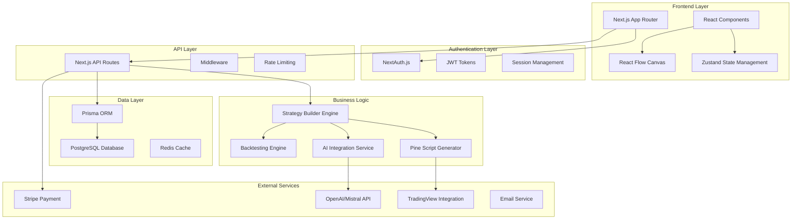

# PineGenie SaaS Design Document

## Overview

PineGenie is an AI-powered TradingView strategy builder that transforms complex Pine Script development into an intuitive, visual experience. The platform combines drag-and-drop interface design with advanced AI capabilities to democratize trading strategy creation for users of all technical skill levels.

## Architecture

### High-Level Architecture



### Technology Stack

- **Frontend**: Next.js 15, React 18, TypeScript, Tailwind CSS
- **State Management**: Zustand
- **Authentication**: NextAuth.js with JWT
- **Database**: PostgreSQL with Prisma ORM
- **Caching**: Redis for session and API caching
- **AI Integration**: OpenAI GPT-4 / Mistral AI
- **Payments**: Stripe
- **Deployment**: Vercel (Frontend) + Railway/Supabase (Database)

## Components and Interfaces

### 1. User Management System

#### User Profile Component
```typescript
interface UserProfile {
  id: string;
  email: string;
  name: string;
  avatar?: string;
  subscription: SubscriptionTier;
  preferences: UserPreferences;
  createdAt: Date;
  lastLoginAt: Date;
}

interface UserPreferences {
  theme: 'light' | 'dark';
  defaultTimeframe: string;
  notifications: NotificationSettings;
  aiAssistanceLevel: 'basic' | 'advanced' | 'expert';
}
```

#### Authentication Flow
- Email/password registration with verification
- OAuth integration (Google, GitHub)
- Password reset with secure tokens
- Session management with refresh tokens
- 2FA optional for premium users

### 2. Strategy Management System

#### Strategy Data Model
```typescript
interface TradingStrategy {
  id: string;
  userId: string;
  name: string;
  description: string;
  category: StrategyCategory;
  nodes: StrategyNode[];
  connections: NodeConnection[];
  pineScriptCode: string;
  backtestResults?: BacktestResult;
  isPublic: boolean;
  tags: string[];
  createdAt: Date;
  updatedAt: Date;
  version: number;
}

interface StrategyNode {
  id: string;
  type: 'indicator' | 'condition' | 'action' | 'data';
  position: { x: number; y: number };
  config: NodeConfiguration;
}
```

#### Strategy Builder Canvas
- React Flow-based visual editor
- Drag-and-drop node system
- Real-time Pine Script generation
- Undo/redo functionality
- Auto-save with version control

### 3. AI Integration System

#### AI Service Interface
```typescript
interface AIService {
  generateStrategy(prompt: string, context?: StrategyContext): Promise<GeneratedStrategy>;
  optimizeStrategy(strategy: TradingStrategy): Promise<OptimizationSuggestions>;
  explainStrategy(strategy: TradingStrategy): Promise<StrategyExplanation>;
  validateCode(pineScript: string): Promise<ValidationResult>;
}

interface GeneratedStrategy {
  nodes: StrategyNode[];
  connections: NodeConnection[];
  explanation: string;
  confidence: number;
  suggestedImprovements: string[];
}
```

#### AI Features Implementation
- Natural language to strategy conversion
- Code optimization suggestions
- Strategy explanation generation
- Error detection and fixing
- Performance improvement recommendations

### 4. Subscription and Billing System

#### Subscription Tiers
```typescript
enum SubscriptionTier {
  FREE = 'free',
  BASIC = 'basic',
  PRO = 'pro',
  ENTERPRISE = 'enterprise'
}

interface SubscriptionLimits {
  strategiesPerMonth: number;
  aiGenerationsPerMonth: number;
  backtestsPerMonth: number;
  storageLimit: number;
  collaborators: number;
  advancedFeatures: string[];
}
```

#### Billing Integration
- Stripe subscription management
- Usage tracking and metering
- Automatic tier enforcement
- Invoice generation
- Payment failure handling

### 5. Backtesting and Analytics System

#### Backtesting Engine
```typescript
interface BacktestEngine {
  runBacktest(strategy: TradingStrategy, config: BacktestConfig): Promise<BacktestResult>;
  compareStrategies(strategies: TradingStrategy[]): Promise<ComparisonResult>;
  generateReport(result: BacktestResult): Promise<PerformanceReport>;
}

interface BacktestConfig {
  symbol: string;
  timeframe: string;
  startDate: Date;
  endDate: Date;
  initialCapital: number;
  commission: number;
}
```

#### Performance Metrics
- Total return, Sharpe ratio, max drawdown
- Win rate, profit factor, average trade
- Risk-adjusted returns
- Monte Carlo analysis
- Strategy comparison tools

### 6. TradingView Integration

#### Pine Script Export System
```typescript
interface PineScriptExporter {
  generateCode(strategy: TradingStrategy): string;
  validateSyntax(code: string): ValidationResult;
  optimizeCode(code: string): string;
  addDocumentation(code: string): string;
}
```

#### Integration Features
- Clean Pine Script v6 code generation
- Syntax validation and error checking
- Code optimization and formatting
- Documentation generation
- Direct publishing to TradingView

## Data Models

### Database Schema

#### Users Table
```sql
CREATE TABLE users (
  id UUID PRIMARY KEY DEFAULT gen_random_uuid(),
  email VARCHAR(255) UNIQUE NOT NULL,
  name VARCHAR(255),
  password_hash VARCHAR(255),
  avatar_url TEXT,
  subscription_tier VARCHAR(50) DEFAULT 'free',
  subscription_expires_at TIMESTAMP,
  preferences JSONB DEFAULT '{}',
  created_at TIMESTAMP DEFAULT NOW(),
  updated_at TIMESTAMP DEFAULT NOW()
);
```

#### Strategies Table
```sql
CREATE TABLE strategies (
  id UUID PRIMARY KEY DEFAULT gen_random_uuid(),
  user_id UUID REFERENCES users(id) ON DELETE CASCADE,
  name VARCHAR(255) NOT NULL,
  description TEXT,
  category VARCHAR(100),
  nodes JSONB NOT NULL DEFAULT '[]',
  connections JSONB NOT NULL DEFAULT '[]',
  pine_script_code TEXT,
  is_public BOOLEAN DEFAULT false,
  tags TEXT[] DEFAULT '{}',
  version INTEGER DEFAULT 1,
  created_at TIMESTAMP DEFAULT NOW(),
  updated_at TIMESTAMP DEFAULT NOW()
);
```

#### Backtest Results Table
```sql
CREATE TABLE backtest_results (
  id UUID PRIMARY KEY DEFAULT gen_random_uuid(),
  strategy_id UUID REFERENCES strategies(id) ON DELETE CASCADE,
  config JSONB NOT NULL,
  results JSONB NOT NULL,
  performance_metrics JSONB NOT NULL,
  created_at TIMESTAMP DEFAULT NOW()
);
```

### Caching Strategy

#### Redis Cache Structure
- User sessions: `session:{sessionId}`
- Strategy cache: `strategy:{userId}:{strategyId}`
- AI responses: `ai:response:{hash}`
- Backtest results: `backtest:{strategyId}:{configHash}`
- Rate limiting: `rate_limit:{userId}:{endpoint}`

## Error Handling

### Error Classification
1. **User Errors**: Invalid input, validation failures
2. **System Errors**: Database failures, API timeouts
3. **External Service Errors**: AI API failures, payment processing
4. **Business Logic Errors**: Strategy validation, limit exceeded

### Error Response Format
```typescript
interface ErrorResponse {
  error: {
    code: string;
    message: string;
    details?: any;
    timestamp: string;
    requestId: string;
  };
}
```

### Error Recovery Strategies
- Automatic retry with exponential backoff
- Graceful degradation for non-critical features
- User-friendly error messages
- Comprehensive logging and monitoring
- Circuit breaker pattern for external services

## Testing Strategy

### Testing Pyramid

#### Unit Tests (70%)
- Component testing with React Testing Library
- Business logic testing with Jest
- Database model testing
- Utility function testing

#### Integration Tests (20%)
- API endpoint testing
- Database integration testing
- External service mocking
- Authentication flow testing

#### End-to-End Tests (10%)
- Critical user journey testing with Playwright
- Strategy creation and export flow
- Payment and subscription flow
- Cross-browser compatibility testing

### Testing Tools
- **Unit/Integration**: Jest, React Testing Library
- **E2E**: Playwright
- **API Testing**: Supertest
- **Performance**: Lighthouse CI
- **Security**: OWASP ZAP

## Security Considerations

### Authentication & Authorization
- JWT tokens with short expiration
- Refresh token rotation
- Role-based access control (RBAC)
- API rate limiting per user tier
- Input validation and sanitization

### Data Protection
- Encryption at rest for sensitive data
- HTTPS enforcement
- SQL injection prevention via Prisma
- XSS protection with Content Security Policy
- CSRF protection with SameSite cookies

### Privacy Compliance
- GDPR compliance for EU users
- Data retention policies
- User data export functionality
- Right to be forgotten implementation
- Privacy policy and terms of service

## Performance Optimization

### Frontend Performance
- Code splitting and lazy loading
- Image optimization with Next.js
- Bundle size optimization
- Service worker for offline functionality
- CDN for static assets

### Backend Performance
- Database query optimization
- Connection pooling
- Redis caching strategy
- API response compression
- Background job processing

### Monitoring and Analytics
- Application performance monitoring (APM)
- Error tracking with Sentry
- User analytics with privacy focus
- Performance metrics dashboard
- Automated alerting system